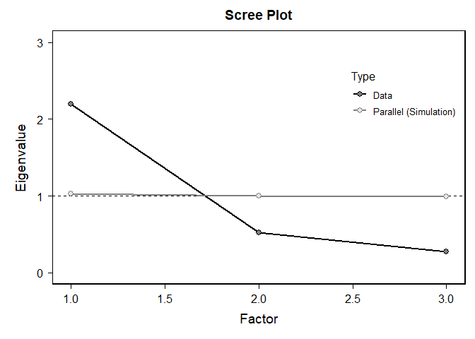

Lab 10
================
Can Zhang
2024-11-15

# Load Packages and Dataset

``` r
library(haven)
library(dplyr)
```

    ## 
    ## 载入程序包：'dplyr'

    ## The following objects are masked from 'package:stats':
    ## 
    ##     filter, lag

    ## The following objects are masked from 'package:base':
    ## 
    ##     intersect, setdiff, setequal, union

``` r
library(ggplot2)
library(tidyr)
library(car)
```

    ## 载入需要的程序包：carData

    ## 
    ## 载入程序包：'car'

    ## The following object is masked from 'package:dplyr':
    ## 
    ##     recode

``` r
library(moments)
library(boot)
```

    ## 
    ## 载入程序包：'boot'

    ## The following object is masked from 'package:car':
    ## 
    ##     logit

``` r
library(bruceR)
```

    ## 
    ## bruceR (v2024.6)
    ## Broadly Useful Convenient and Efficient R functions
    ## 
    ## Packages also loaded:
    ## ✔ data.table ✔ emmeans
    ## ✔ dplyr      ✔ lmerTest
    ## ✔ tidyr      ✔ effectsize
    ## ✔ stringr    ✔ performance
    ## ✔ ggplot2    ✔ interactions
    ## 
    ## Main functions of `bruceR`:
    ## cc()             Describe()  TTEST()
    ## add()            Freq()      MANOVA()
    ## .mean()          Corr()      EMMEANS()
    ## set.wd()         Alpha()     PROCESS()
    ## import()         EFA()       model_summary()
    ## print_table()    CFA()       lavaan_summary()
    ## 
    ## For full functionality, please install all dependencies:
    ## install.packages("bruceR", dep=TRUE)
    ## 
    ## Online documentation:
    ## https://psychbruce.github.io/bruceR
    ## 
    ## To use this package in publications, please cite:
    ## Bao, H.-W.-S. (2024). bruceR: Broadly useful convenient and efficient R functions (Version 2024.6) [Computer software]. https://CRAN.R-project.org/package=bruceR

    ## 
    ## These packages are dependencies of `bruceR` but not installed:
    ## - pacman, openxlsx, ggtext, see, lmtest, vars, phia, MuMIn, GGally
    ## 
    ## ***** Install all dependencies *****
    ## install.packages("bruceR", dep=TRUE)

``` r
library(psych)
```

    ## 
    ## 载入程序包：'psych'

    ## The following object is masked from 'package:effectsize':
    ## 
    ##     phi

    ## The following object is masked from 'package:boot':
    ## 
    ##     logit

    ## The following object is masked from 'package:car':
    ## 
    ##     logit

    ## The following objects are masked from 'package:ggplot2':
    ## 
    ##     %+%, alpha

``` r
load("C:/Users/zhang/OneDrive/2024-25/PSY329/ICPSR_38964-V2/ICPSR_38964/DS0001/38964-0001-Data.rda")
dataset <- da38964.0001
rm(da38964.0001)
```

# Data Cleaning

``` r
#Select variables related to my research question
my_dataset <- dataset %>% select(RELIG_ATTEND, RELIG_IMP, RACEREC, LONELY_A, LONELY_B, LONELY_C)
my_dataset <- drop_na(my_dataset)
summary(my_dataset)
```

    ##                            RELIG_ATTEND                     RELIG_IMP   
    ##  (01) At least once a week       :1346   (1) Very important      :2564  
    ##  (02) About once or twice a month: 655   (2) Somewhat important  :2333  
    ##  (03) A few times                :1135   (3) Not too important   :1278  
    ##  (04) Once or twice              :1072   (4) Not at all important:1469  
    ##  (05) Never                      :3436                                  
    ##  (98) Don't Know                 :   0                                  
    ##                                                                         
    ##                                             RACEREC    
    ##  (01) Non-Hispanic White                        :4580  
    ##  (02) Non-Hispanic Black                        :1089  
    ##  (03) Non-Hispanic American Indian/Alaska Native: 103  
    ##  (04) Hispanic                                  :1387  
    ##  (05) Non-Hispanic Asian or Pacific Islander    : 393  
    ##  (06) Other and 2 or more races                 :  88  
    ##  (98) Don't know                                :   4  
    ##                   LONELY_A                     LONELY_B   
    ##  (01) Hardly ever     :3171   (01) Hardly ever     :2926  
    ##  (02) Some of the time:3036   (02) Some of the time:3197  
    ##  (03) Often           :1428   (03) Often           :1514  
    ##  (98) Don't Know      :   0   (98) Don't Know      :   0  
    ##  (99) Refusal         :   9   (99) Refusal         :   7  
    ##                                                           
    ##                                                           
    ##                   LONELY_C   
    ##  (01) Hardly ever     :2911  
    ##  (02) Some of the time:2949  
    ##  (03) Often           :1778  
    ##  (98) Don't Know      :   0  
    ##  (99) Refusal         :   6  
    ##                              
    ## 

``` r
#recode and composite the variables
my_dataset$RELIG_ATTEND <- 5 - as.numeric(my_dataset$RELIG_ATTEND)
my_dataset$RELIG_IMP <- 5 - as.numeric(my_dataset$RELIG_IMP)
my_dataset$RELIG_ENGAGEMENT <- (my_dataset$RELIG_ATTEND + my_dataset$RELIG_IMP) / 2

my_dataset$LONELY_A <- as.numeric(my_dataset$LONELY_A)
my_dataset$LONELY_B <- as.numeric(my_dataset$LONELY_B)
my_dataset$LONELY_C <- as.numeric(my_dataset$LONELY_C)
my_dataset$LONELY <- (my_dataset$LONELY_A + my_dataset$LONELY_B + my_dataset$LONELY_C) / 3
```

# Reliability and Factor Analysis

``` r
# Cronbach's Alpha
Alpha(my_dataset, vars = c("LONELY_A", "LONELY_B", "LONELY_C"))
```

    ## 
    ## Reliability Analysis
    ## 
    ## Summary:
    ## Total Items: 3
    ## Scale Range: 1 ~ 5
    ## Total Cases: 7644
    ## Valid Cases: 7644 (100.0%)
    ## 
    ## Scale Statistics:
    ## Mean = 1.816
    ## S.D. = 0.647
    ## Cronbach’s α = 0.816
    ## McDonald’s ω = 0.823
    ## 
    ## Item Statistics (Cronbach’s α If Item Deleted):
    ## ───────────────────────────────────────────────────
    ##            Mean    S.D. Item-Rest Cor. Cronbach’s α
    ## ───────────────────────────────────────────────────
    ## LONELY_A  1.776 (0.750)          0.575        0.838
    ## LONELY_B  1.818 (0.746)          0.721        0.692
    ## LONELY_C  1.854 (0.774)          0.712        0.699
    ## ───────────────────────────────────────────────────
    ## Item-Rest Cor. = Corrected Item-Total Correlation

``` r
# Factor Analysis
EFA(my_dataset, vars = c("LONELY_A", "LONELY_B", "LONELY_C"), method = "pa", plot.scree = TRUE, nfactors = c("parallel"))
```

    ## 
    ## Explanatory Factor Analysis
    ## 
    ## Summary:
    ## Total Items: 3
    ## Scale Range: 1 ~ 5
    ## Total Cases: 7644
    ## Valid Cases: 7644 (100.0%)
    ## 
    ## Extraction Method:
    ## - Principal Axis Factor Analysis
    ## Rotation Method:
    ## - (Only one component was extracted. The solution was not rotated.)
    ## 
    ## KMO and Bartlett's Test:
    ## - Kaiser-Meyer-Olkin (KMO) Measure of Sampling Adequacy: MSA = 0.685
    ## - Bartlett's Test of Sphericity: Approx. χ²(3) = 8672.59, p < 1e-99 ***
    ## 
    ## Total Variance Explained:
    ## ───────────────────────────────────────────────────────────────────────────────
    ##           Eigenvalue Variance % Cumulative % SS Loading Variance % Cumulative %
    ## ───────────────────────────────────────────────────────────────────────────────
    ## Factor 1       2.196     73.212       73.212      1.836     61.185       61.185
    ## Factor 2       0.525     17.492       90.704                                   
    ## Factor 3       0.279      9.296      100.000                                   
    ## ───────────────────────────────────────────────────────────────────────────────
    ## 
    ## Factor Loadings (Sorted by Size):
    ## ───────────────────────────
    ##             PA1 Communality
    ## ───────────────────────────
    ## LONELY_B  0.855       0.730
    ## LONELY_C  0.843       0.710
    ## LONELY_A  0.629       0.395
    ## ───────────────────────────
    ## Communality = Sum of Squared (SS) Factor Loadings
    ## (Uniqueness = 1 - Communality)

<!-- -->

``` r
# Spearman's Rho
spearman_rho <- cor(my_dataset$RELIG_ATTEND, my_dataset$RELIG_IMP, method = "spearman")
print(spearman_rho)
```

    ## [1] 0.600681
